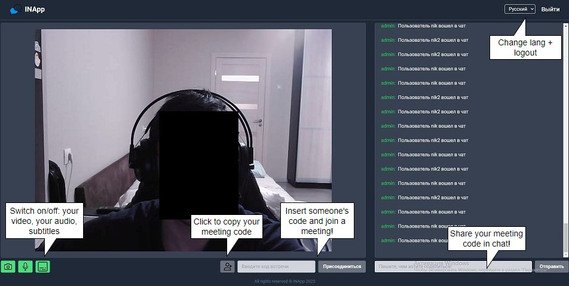
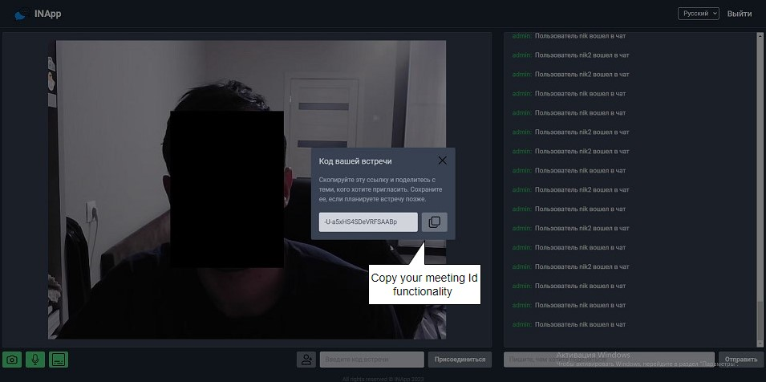
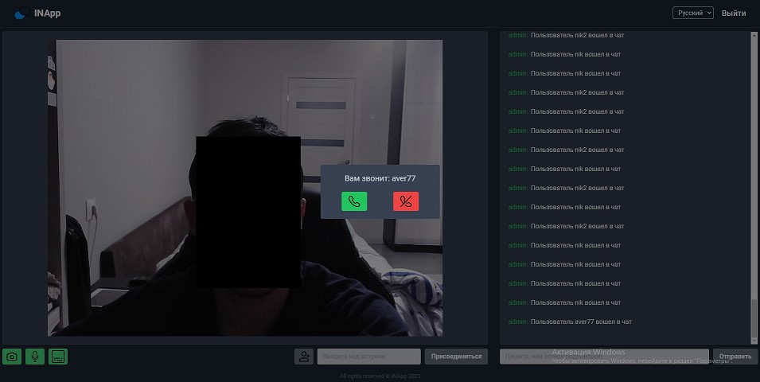
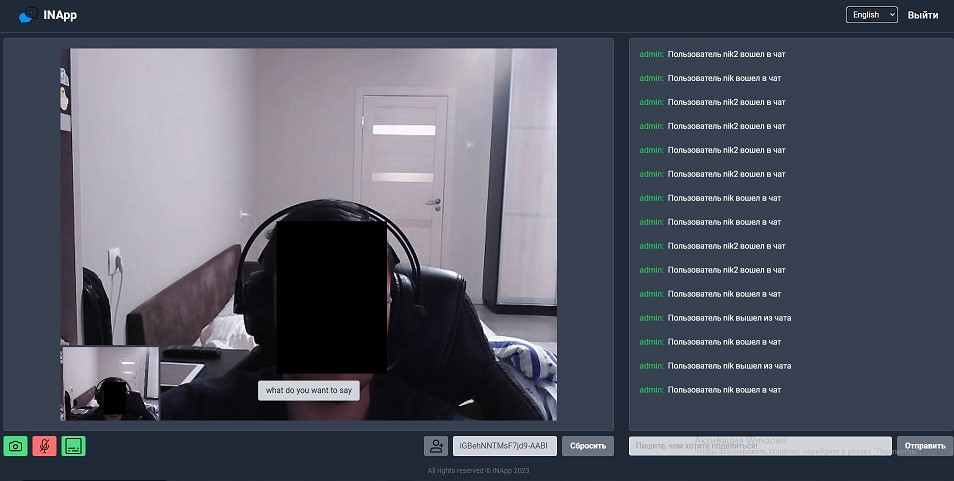

# INApp-chat

Modern chat app based on websockets and simple-peer library.

## Project launch command:
### `npm install && npm start`
*Runs the app in the development mode.\
Open [http://localhost:3000](http://localhost:3000) to view it in the browser.*

## Project usage:

1. Project layout with whom you can interact  

2. Copy your meeting id and send it to shared chat

__Your future interlocutor should use your meeting id to call you__

3. After other user called - you can accept or decline it 

4. Congrats! If you accept the call - video connection successfully established

*you can see and hear your interlocutor, and also read the subtitles on language you chose*

### Project is launched by INApp team. 
### All rights reserved.

